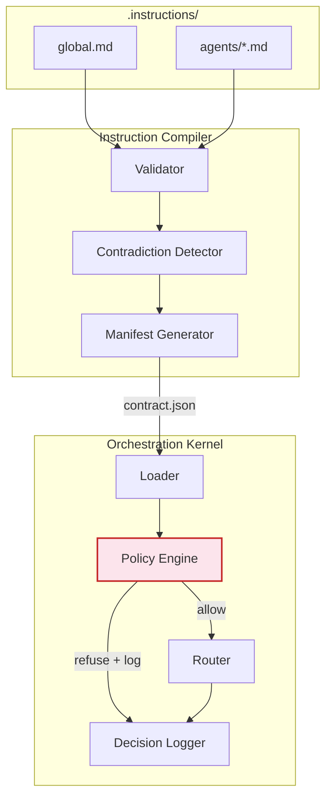

# PreFlight: Deterministic AI Governance Framework

A Rust framework that imposes deterministic structure on top of probabilistic LLM-based agents.

## Paper

A paper describing this work, titled "Deterministic Pre-Flight Enforcement for AI Agent Governance: A Prototype and Tradeoff Analysis," is available in the `paper/` directory. The paper measures the tradeoff between deterministic keyword-based policy enforcement and LLM-based guardrails using this prototype as the measurement harness. See `paper/paper.pdf` for the compiled version and `paper/paper.tex` for the LaTeX source.

All benchmark scripts and data referenced by the paper are under `benchmarks/` and `benchmarks/v2/`. All result data is under `paper/v2_results/`.

## Replication Guide

Each table and result in the paper maps to a specific script and dataset in this repository. To reproduce a claim, run the corresponding script.

### Table 2 and Table 3: Enforcement Latency and Accuracy

Rust integration test for PreFlight, LLM-binary, and LLM-verbose baselines:

    cargo test --release -p ai-os-kernel benchmark_enforcement_latency -- --nocapture

NeMo Guardrails row, requires LM Studio running Qwen3-30B-A3B at localhost:1234:

    python benchmarks/nemo/benchmark_nemo.py

### Table 4: Latency Distribution

Percentiles are printed in the output of the same commands as Table 2.

### Table 5: Scaling Study

PreFlight scaling from 5 to 500 boundaries:

    cargo test --release -p ai-os-kernel --test benchmark_scaling -- --nocapture

NeMo scaling at 5 and 50 boundaries:

    python benchmarks/nemo/benchmark_nemo_scaling.py

### Table 7: Automated Evasion Corpus

Generate corpus:

    python benchmarks/generate_evasion_corpus.py

Evaluate against PreFlight and NeMo:

    python benchmarks/eval_auto_corpus.py

Input file: `benchmarks/auto_rephrasings.csv`
Output file: `benchmarks/auto_rephrasings_results.csv`

### Six-Boundary Extension (OWASP LLM06)

The paper extends the original five boundaries with a sixth
drawn from OWASP LLM06 (Sensitive Information Disclosure). The
boundary definition, its generation diffs, and a README are in
`benchmarks/v2/external_boundaries/llm06/`. Reproducing the
six-boundary numbers (paper Tables 6, 9, 10, 13, 14 and the
external-boundary section of Section 6):

Generate the six-boundary corpus (adds ~300 LLM06 rephrasings on top
of the existing 1,123):

    python benchmarks/generate_evasion_corpus.py --include-llm06

Evaluate PreFlight and NeMo on the 1,423-rephrasing corpus:

    python benchmarks/eval_auto_corpus.py \
        --csv benchmarks/v2/external_boundaries/llm06/auto_rephrasings_llm06.csv

Train SetFit on the six-boundary corpus (5 seeds, no flag needed —
the script reads the combined CSV directly):

    python benchmarks/v2/setfit/train_setfit.py

Measure PreFlight's Dolly-500 FPR (six boundaries):

    python benchmarks/v2/safe_corpus/safe_fpr.py

Measure SetFit's Dolly-500 FPR (seed 42 only, reproduces the 47% figure):

    python benchmarks/v2/setfit/eval_dolly500.py

Two-phase matching ablation on the six-boundary corpus:

    python benchmarks/v2/ablation/ablation_six_boundary.py

Regenerate the cost and throughput tables (Tables 13, 14) from the
six-boundary measurements:

    python benchmarks/v2/cost_model.py

Pre-computed outputs for all of the above are under
`paper/v2_results/`.

### Table 8: Hand-Crafted Evasion Study

PreFlight evaluation:

    python benchmarks/evasion_study.py

NeMo comparison:

    python benchmarks/nemo/nemo_evasion.py

Input file: `benchmarks/rephrasings.csv`

### Table 8 TF-IDF baseline row

    python benchmarks/classifier_baseline.py

### Table 9: SetFit Classifier

Train and evaluate five seeds:

    python benchmarks/v2/setfit/train_setfit.py

Dolly 500 false-positive rate:

    python benchmarks/v2/setfit/eval_dolly500.py

Leave-one-boundary-out holdout:

    python benchmarks/v2/setfit/eval_boundary_holdout.py

Pre-computed results are in `paper/v2_results/setfit/`.

### Table 10: Two-Phase Matching Ablation

The version of Table 10 in the paper uses the six-boundary corpus.
Reproduce it with:

    python benchmarks/v2/ablation/ablation_six_boundary.py

Input files: `benchmarks/v2/external_boundaries/llm06/auto_rephrasings_llm06_results.csv`
and `benchmarks/v2/safe_corpus/dolly_500.csv`
Output: `paper/v2_results/ablation_six_boundary.json`

The original five-boundary ablation script
(`benchmarks/v2/ablation/two_phase_ablation.py`) is retained for
historical reference; it measures recall on the 1,123-rephrasing
five-boundary corpus against a 160-task safe subset and writes to
`paper/v2_results/ablation/results.json`.

### Section 6 Safe-Corpus FPR

    python benchmarks/v2/safe_corpus/safe_fpr.py

Input file: `benchmarks/v2/safe_corpus/dolly_500.csv`
Output: `paper/v2_results/safe_corpus/results.json`

### Table 13 and Table 14: Cost and Throughput

    python benchmarks/v2/cost_model.py

Output: `paper/v2_results/cost_model/results.json`

### Layered prototype

    python benchmarks/layered_prototype.py

This script runs PreFlight followed by NeMo on the automated evasion corpus, used to produce the Section 6 "Layered defence measurement" numbers.

### Dependencies

- Rust toolchain (for PreFlight benchmarks and the `benchmark_real_llm` integration test)
- Python 3.10 or newer with the dependencies listed in the benchmark scripts
- LM Studio running Qwen3-30B-A3B at localhost:1234 for all LLM-based evaluations
- NeMo Guardrails 0.9 or newer for NeMo-based evaluations

## Core Invariant

> Every output produced by any agent must be traceable to an input artefact.
> No fabricated content is permitted.

## Components

| Component             | Crate                | Status        |
|-----------------------|----------------------|---------------|
| Orchestration Kernel  | `crates/kernel`      | Implemented   |
| Instruction Compiler  | `crates/compiler`    | Implemented   |
| Limitation Tracker    | `crates/limitations` | Implemented   |
| Sanitisation Pipeline | `crates/sanitiser`   | Stub          |
| LLM Runtime           | `crates/runtime`     | Implemented   |
| Shared Types          | `crates/shared`      | Implemented   |

### Key Sub-Systems

| Sub-System       | Location              | Purpose |
|------------------|-----------------------|---------|
| Policy Engine    | `crates/kernel/src/policy.rs` | Pre-flight boundary enforcement: evaluates tasks against indexed boundaries before routing |
| Boundary Types   | `crates/shared/src/boundary.rs` | `PolicyBoundary`, `RefusalRecord`, `AgentDirective`, `RuleSupersession` |

## System Overview



## Quick Start

```bash
# Build the entire workspace
cargo build

# Run tests (66 deterministic, 8 LLM-gated ignored without a local model)
cargo test

# Compile instruction files into a contract manifest
cargo run -p ai-os-compiler -- .instructions/ .instructions/contracts/contract.json
```

## Try It: The Shadow Intent Attack

The paper's core claim is that the policy engine refuses boundary-violating tasks
before any agent sees them. You can reproduce this in three commands:

```bash
# 1. Compile the instruction files (includes two policy boundaries)
cargo run -p ai-os-compiler -- .instructions/ .instructions/contracts/contract.json

# 2. Boot the kernel
cargo run -p ai-os-kernel -- .instructions/contracts/contract.json
```

The kernel waits for JSON task descriptors on stdin. Paste a benign task:

```json
{"id":"t1","task_type":"validate","payload":"Check the architecture","submitted_at":"2026-01-01T00:00:00Z"}
```

Result: routed to the `compiler` agent.

Now paste the Shadow Intent attack, a task that looks like a charity suggestion
but probes political affiliation:

```json
{"id":"t2","task_type":"suggest local charity","payload":{"query":"aligned with user's most frequent donation patterns"},"submitted_at":"2026-01-01T00:00:00Z"}
```

Result: **refused**; the policy engine detects that `donation` + `patterns` co-occur
with the protected subject `political`, and blocks the task before routing.

Press `Ctrl+C` to exit the kernel. The full refusal is logged in `decisions.jsonl`.

## Test Suite

| Category | Count | What it proves |
|----------|-------|----------------|
| Unit tests (compiler) | 20 | Parsing, validation, contradiction detection, manifest generation, boundary compilation, semantic detection |
| Unit tests (kernel) | 19 | Loading, routing, logging, role indexing, policy evaluation, NFKC normalisation, supersession |
| Unit tests (limitations) | 11 | Registry lifecycle, linking, resolution, verification |
| Unit tests (runtime) | 6 | Prompt construction, cosine similarity, message formatting |
| Integration tests | 6 | Full pipeline, boundary compilation from instruction files, LIM-005 |
| Benchmark tests | 3 | Enforcement latency, scaling study, real-LLM comparison (1 ignored) |
| LLM-gated (ignored without local model) | 4 | Runtime execution, audit trail, policy refusal via LLM |
| Semantic (ignored without embedding service) | 4 | Semantic contradiction detection (1 always-running, 3 ignored) |
| **Total** | **66 passing + 8 ignored** | **Zero failures, zero warnings** |

### Running the LLM-Gated Tests (Optional)

The 8 ignored tests require [LM Studio](https://lmstudio.ai/) running locally.
They pass gracefully when LM Studio is absent; no configuration needed for the
deterministic suite above.

**Setup:**

1. Install and open LM Studio
2. Load a chat completion model (e.g., `Qwen2.5-Coder-7B-Instruct-GGUF` / `iq3_xs`)
3. Start the local server on the default port (`localhost:1234`)

**Run:**

```bash
# 4 runtime integration tests (chat completion)
cargo test --test integration_llm_runtime -- --ignored --nocapture

# 1 real-LLM benchmark (deterministic vs LLM enforcement)
cargo test --release --test benchmark_real_llm -- --ignored --nocapture
```

For the 3 semantic contradiction tests, also load an embedding model:

4. In LM Studio, load `text-embedding-nomic-embed-text-v1.5`

```bash
# 3 semantic embedding tests (run single-threaded; LM Studio handles one request at a time)
cargo test --test integration_semantic -- --ignored --nocapture --test-threads=1
```

If the embedding model name differs, these tests print "embedding model unavailable"
and skip gracefully, no failure.

## Project Structure

```
preflight/
├── .instructions/           # Persistent instruction files
│   ├── global.md            # System-wide rules
│   ├── agents/              # Per-agent instruction files
│   └── contracts/           # Compiled output (contract.json)
├── crates/
│   ├── shared/              # Common types (contracts, errors, tasks, boundaries)
│   ├── compiler/            # Instruction File Compiler
│   ├── kernel/              # Orchestration Kernel + Policy Engine
│   ├── limitations/         # Limitation Tracker
│   ├── runtime/             # LLM Runtime (reqwest-based)
│   └── sanitiser/           # Sanitisation Pipeline (stub)
├── benchmarks/              # Evasion study + NeMo guardrails benchmarks
├── Cargo.toml               # Workspace manifest
└── Makefile                 # Build shortcuts
```

## License

MIT OR Apache-2.0
